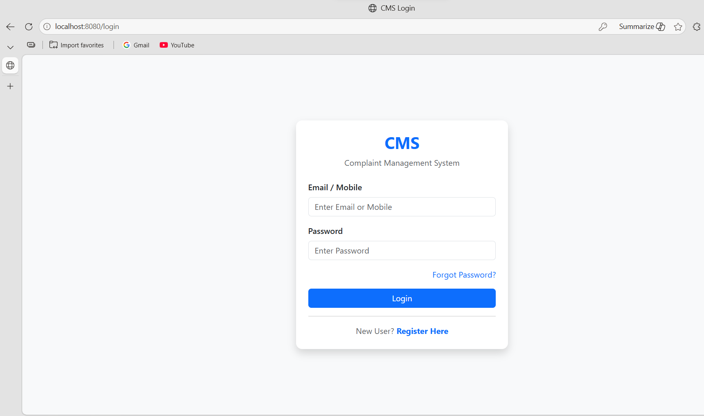
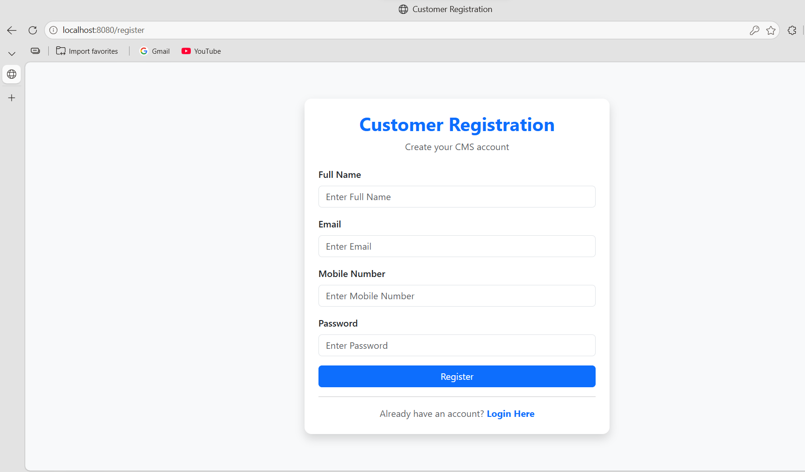
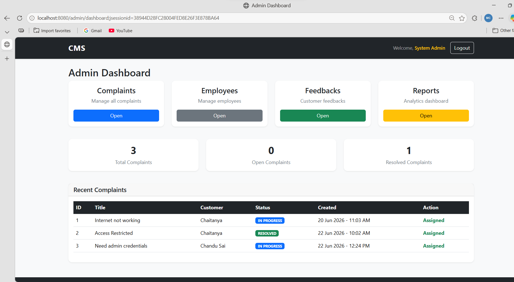
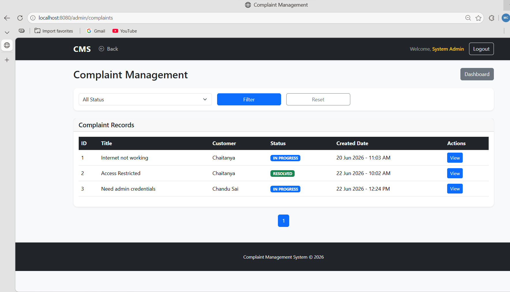
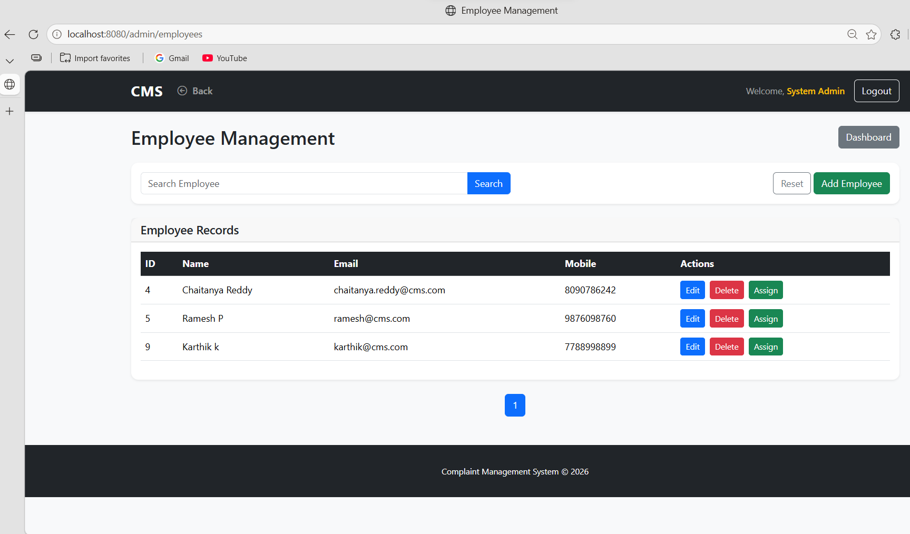
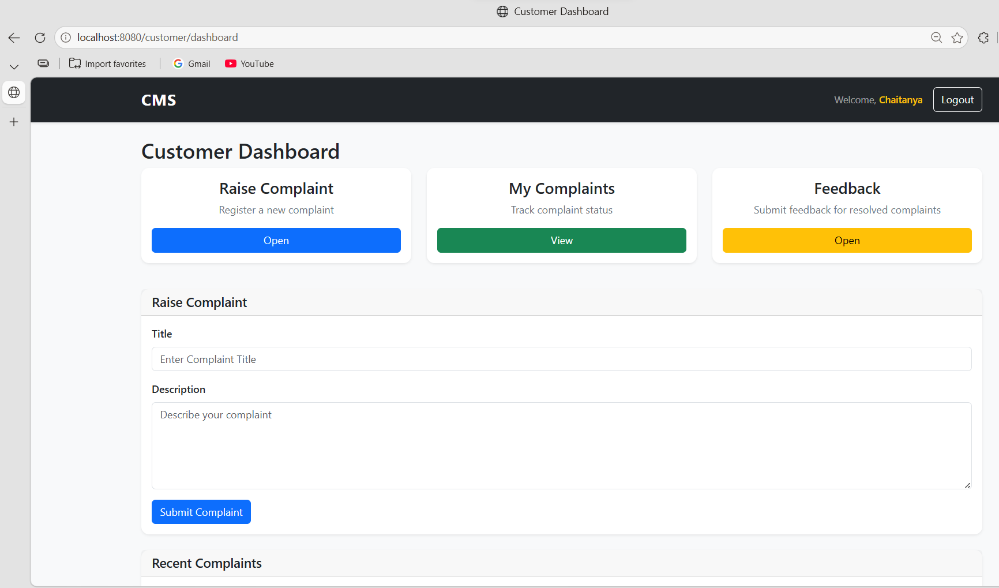
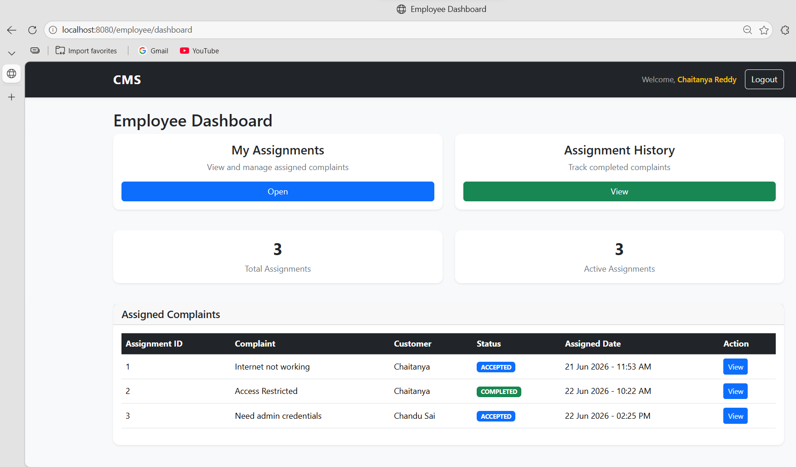
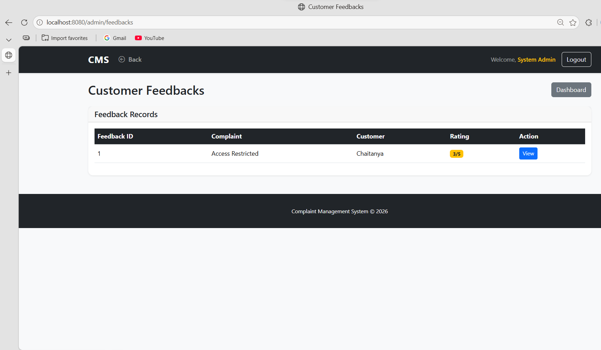
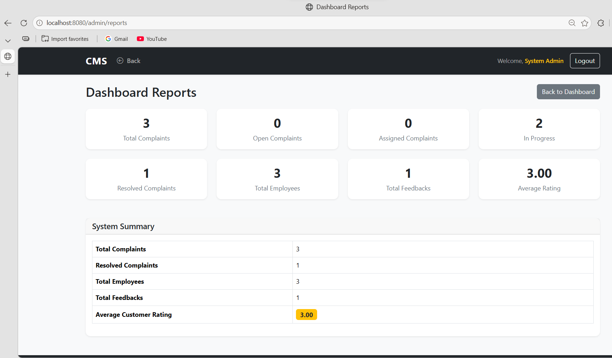

# Complaint Management System

## Overview

The Complaint Management System (CMS) is a role-based web application developed using Spring Boot and Thymeleaf. It helps organizations manage customer complaints efficiently through complaint registration, assignment, tracking, resolution, feedback collection, and reporting.

The system supports three user roles:

* Admin
* Employee
* Customer

---

## Features

### Customer

* User Registration
* Login
* Forgot Password
* Reset Password
* Raise Complaint
* View Complaint Status
* Edit Complaint (when applicable)
* Delete Complaint (when applicable)
* Submit Feedback

### Employee

* View Assigned Complaints
* Accept Assignments
* Complete Assignments
* Track Complaint Progress

### Admin

* Dashboard Statistics
* Complaint Management
* Complaint Assignment
* Employee Management
* Feedback Management
* Reports Dashboard

---

## Technology Stack

### Backend

* Java 17
* Spring Boot
* Spring MVC
* Spring Data JPA

### Frontend

* Thymeleaf
* Bootstrap 5
* HTML5
* CSS3

### Database

* MySQL

### Build Tool

* Maven

---

## Project Architecture

Controller Layer

↓

Service Layer

↓

Repository Layer

↓

Database

---

## Modules

### Authentication Module

* Registration
* Login
* Forgot Password
* Reset Password

### Complaint Module

* Create Complaint
* View Complaint
* Update Complaint
* Delete Complaint
* Complaint Tracking

### Assignment Module

* Assign Complaint
* Accept Assignment
* Complete Assignment

### Feedback Module

* Submit Feedback
* View Feedback
* Feedback Reports

### Reporting Module

* Total Complaints
* Open Complaints
* Assigned Complaints
* Resolved Complaints
* Employee Statistics
* Customer Rating Statistics

---

## Screenshots

### Login Page

### Registration Page

### Admin Dashboard

### Complaint Management

### Employee Management

### Customer Dashboard

### Employee Dashboard

### Feedback Management

### Reports Dashboard

---

## Exception Handling

Implemented centralized exception handling using:

* GlobalExceptionHandler
* Custom Exceptions

Examples:

* UserNotFoundException
* ComplaintNotFoundException
* AssignmentNotFoundException
* FeedbackAlreadyExistsException
* InvalidInputException

---

## Validation

Implemented validation using Jakarta Validation:

* Email Validation
* Mobile Validation
* Password Validation
* Complaint Validation
* Feedback Validation

---

## Future Enhancements

* Spring Security
* BCrypt Password Encryption
* Email Notifications
* REST API Version
* Docker Support
* Unit Testing using JUnit and Mockito
* Role Based Security using Spring Security

---

## Author

Chaitanya Reddy

Java | Spring Boot | Thymeleaf | MySQL
